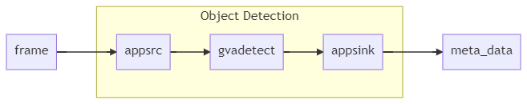
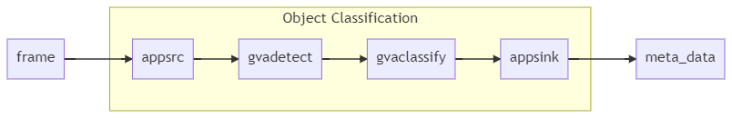
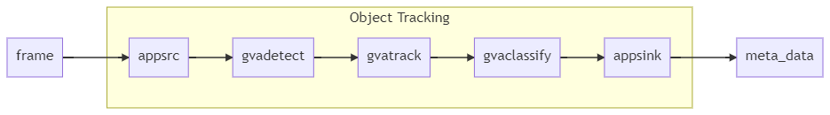
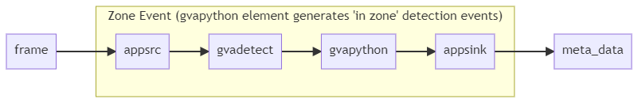
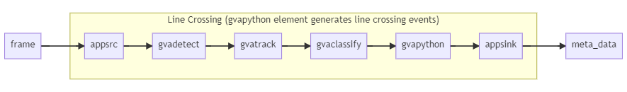
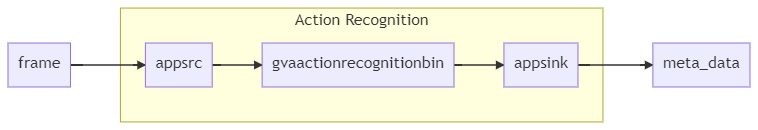

# Intel® DL Streamer – Edge AI Extension

| [Getting Started](#getting-started) | [Edge AI Extension Server Options](#edge-ai-extension-server-options) | [Edge AI Extension Requests](#edge-ai-extension-requests)| [Edge AI Extension Client](#edge-ai-extension-client) | [Spatial Analytics](#spatial-analytics-pipelines)| [Changing Models](#updating-or-changing-detection-and-classification-models)

The Intel® DL Streamer – Edge AI Extension is a microservice based on [DL Streamer Pipeline Server](https://github.com/dlstreamer/pipeline-server) that provides video analytics pipelines built with OpenVINO™ DL Streamer. Developers can send decoded video frames to the AI Extension which performs detection, classification, or tracking and returns the results. The AI Extension exposes [gRPC](https://docs.microsoft.com/en-us/azure/azure-video-analyzer/video-analyzer-docs/grpc-extension-protocol) and [HTTP](https://docs.microsoft.com/en-us/azure/azure-video-analyzer/video-analyzer-docs/edge/http-extension-protocol) protocol APIs that are compatible with [Azure Video Analyzer](https://azure.microsoft.com/en-us/products/video-analyzer/) (AVA). Powered by OpenVINO™ toolkit, the AI Extension enables developers to build, optimize and deploy deep learning inference workloads for the best performance across Intel® architectures.

> This document assumes a working knowledge of [DL Streamer Pipeline Server](https://github.com/dlstreamer/pipeline-server).

## Highlights

- Spatial analytics features: [Object Line Crossing](#object-line-crossing) and [Object Zone Count](#object-zone-count) similar to [Azure Video Analyzer Spatial Analysis](https://docs.microsoft.com/en-us/azure/azure-video-analyzer/video-analyzer-docs/computer-vision-for-spatial-analysis?tabs=azure-stack-edge)
- Scalable, high-performance solution for serving video analytics pipelines on Intel® architectures
- gRPC extension enables fast data transfer rate and low latency
- HTTP extension provides a simpler API with inference results as JSON response
- Supported Configuration: Pre-built Ubuntu Linux container for CPU, iGPU, Intel&reg; Neural Compute Stick 2 (NCS2) and HDDL-R inference accelerators
- Pre-loaded Object Detection, Object Classification, Object Tracking and Action Recognition pipelines to get started quickly
- Pre-loaded models - see table below.

| Name | Version   | Model |
| -----|-----------| ------|
| object_detection| person_vehicle_bike |[person-vehicle-bike-detection-crossroad-0078](https://github.com/openvinotoolkit/open_model_zoo/blob/2021.4/models/intel/person-vehicle-bike-detection-crossroad-0078/README.md)|
| object_detection|person|[person-detection-retail-0013](https://github.com/openvinotoolkit/open_model_zoo/blob/2021.4/models/intel/person-detection-retail-0013/README.md)|
| object_detection|vehicle|[vehicle-detection-0202](https://github.com/openvinotoolkit/open_model_zoo/blob/2021.4/models/intel/vehicle-detection-0202/README.md)|
| object_classification |vehicle_attributes|[vehicle-attributes-recognition-barrier-0039](https://github.com/openvinotoolkit/open_model_zoo/blob/2021.4/models/intel/vehicle-attributes-recognition-barrier-0039/README.md)|
| action_recognition|decoder|[action-recognition-0001-decoder](https://github.com/openvinotoolkit/open_model_zoo/blob/2021.4/models/intel/action-recognition-0001/README.md)|
| action_recognition|encoder|[action-recognition-0001-encoder](https://github.com/openvinotoolkit/open_model_zoo/blob/2021.4/models/intel/action-recognition-0001/README.md)|

## What's New

- Added Support for [AVA HTTP extension protocol](https://docs.microsoft.com/en-us/azure/azure-video-analyzer/video-analyzer-docs/edge/http-extension-protocol)

> **IMPORTANT:** DL Streamer Edge AI Extension is provided as a  _sample_. It is not intended to be deployed into production environments without modification. Developers deploying DL Streamer Edge AI Extension should review it against their production requirements.

# Getting Started

The Intel® DL Streamer – Edge AI Extension can run as a standalone microservice or as a module within an Azure Video Analyzer graph. For more information on deploying the module as part of an Azure Video Analyzer graph please see [Configuring the AI Extension for Azure Video Analyzer](#configuring-the-ai-extension-for-azure-video-analyzer) and refer to the [Azure Video Analyzer documentation](https://docs.microsoft.com/en-us/azure/azure-video-analyzer/video-analyzer-docs/overview). The following instructions demonstrate building and running the microservice and test client outside of Azure Video Analyzer.

## Supported Hardware

Refer to [OpenVINO System Requirements](https://software.intel.com/content/www/us/en/develop/tools/openvino-toolkit/system-requirements.html) for supported development and target runtime platforms and the [OpenVINO Container Release Notes](https://hub.docker.com/r/openvino/ubuntu20_data_runtime) for details on providing access to accelerator devices.

## Building the Edge AI Extension Image

### Prerequisites

Building the image requires a modern Linux distro with the following packages installed:

| |                  |
|---------------------------------------------|------------------|
| **Docker** | Edge AI Extension requires Docker for its build, development, and runtime environments. Please install the latest for your platform. [Docker](https://docs.docker.com/install). |
| **bash** | Edge AI Extension's build and run scripts require bash and have been tested on systems using versions greater than or equal to: `GNU bash, version 4.3.48(1)-release (x86_64-pc-linux-gnu)`. Most users shouldn't need to update their version but if you run into issues please install the latest for your platform. Instructions for macOS&reg;* users [here](https://github.com/dlstreamer/pipeline-server/blob/master/docs/installing_bash_macos.md). |

### Building the Image

Run the docker image build script.

```bash
./docker/build.sh
```

Resulting image name is `dlstreamer-edge-ai-extension:0.7.1`

## Running the Edge AI Extension

### gRPC Extension Protocol

To run the Edge AI Extension gRPC server as a standalone microservice use the `run_server.sh` script with default options. For examples of additional options see [Edge AI Extension Server Options](#edge-ai-extension-server-options).

```bash
./docker/run_server.sh
```

```text
<snip>
{"levelname": "INFO", "asctime": "2021-12-01 21:54:13,049", "message": "Starting GRPC DL Streamer Edge AI Extension on port: 5001", "module": "grpc_server"}
```

To send a test frame to the microservice and receive `object_detection` results use the `run_client.sh` script.

```bash
./docker/run_client.sh
```

```text
[AIXC] [2021-12-01 21:54:33,661] [MainThread  ] [INFO]: Extension Configuration: {'pipeline': {'name': 'object_detection', 'version': 'person_vehicle_bike'}}
[AIXC] [2021-12-01 21:54:33,665] [Thread-2    ] [INFO]: MediaStreamDescriptor request #1
[AIXC] [2021-12-01 21:54:33,668] [MainThread  ] [INFO]: [Received] AckNum: 1
[AIXC] [2021-12-01 21:54:34,034] [MainThread  ] [INFO]: ENTITY - person (1.00) [0.30, 0.47, 0.09, 0.39] []
[AIXC] [2021-12-01 21:54:34,034] [MainThread  ] [INFO]: ENTITY - person (0.97) [0.36, 0.40, 0.05, 0.24] []
[AIXC] [2021-12-01 21:54:34,035] [MainThread  ] [INFO]: ENTITY - person (0.94) [0.44, 0.42, 0.08, 0.43] []
[AIXC] [2021-12-01 21:54:34,035] [MainThread  ] [INFO]: ENTITY - person (0.92) [0.57, 0.38, 0.05, 0.25] []
[AIXC] [2021-12-01 21:54:34,035] [MainThread  ] [INFO]: ENTITY - person (0.91) [0.69, 0.56, 0.12, 0.43] []
[AIXC] [2021-12-01 21:54:34,035] [MainThread  ] [INFO]: ENTITY - person (0.90) [0.68, 0.42, 0.04, 0.24] []
[AIXC] [2021-12-01 21:54:34,035] [MainThread  ] [INFO]: ENTITY - person (0.82) [0.64, 0.36, 0.05, 0.27] []
[AIXC] [2021-12-01 21:54:34,035] [MainThread  ] [INFO]: ENTITY - person (0.60) [0.84, 0.44, 0.05, 0.29] []
[AIXC] [2021-12-01 21:54:34,036] [MainThread  ] [INFO]: Start Time: 1638395673.6689658 End Time: 1638395674.0366473 Frames: Tx 1 Rx 1 FPS: 2.7197451898885205
[AIXC] [2021-12-01 21:54:34,038] [MainThread  ] [INFO]: Client finished execution
```

### HTTP Extension Protocol

To run the Edge AI Extension gRPC server as a standalone microservice use the `run_server.sh` script with `--protocol http` argument, this starts server on default HTTP port 8000. For examples of additional options see [Edge AI Extension Server Options](#edge-ai-extension-server-options).

```bash
./docker/run_server.sh --protocol http
```

```text
<snip>
{"levelname": "INFO", "asctime": "2021-12-01 21:55:34,882", "message": "Starting HTTP DL Streamer Edge AI Extension on port: 8000", "module": "http_server"}
```

To send a test frame to the microservice and receive `object_detection` results use the `run_client.sh` script with `--protocol http` option.

```bash
./docker/run_client.sh --protocol http
```

```text
[AIXC] [2021-12-01 21:57:06,947] [MainThread  ] [INFO]: ENTITY - person (1.00) [0.30, 0.46, 0.09, 0.39] []
[AIXC] [2021-12-01 21:57:06,948] [MainThread  ] [INFO]: ENTITY - person (0.97) [0.36, 0.40, 0.05, 0.24] []
[AIXC] [2021-12-01 21:57:06,948] [MainThread  ] [INFO]: ENTITY - person (0.96) [0.43, 0.42, 0.09, 0.44] []
[AIXC] [2021-12-01 21:57:06,948] [MainThread  ] [INFO]: ENTITY - person (0.95) [0.69, 0.55, 0.13, 0.44] []
[AIXC] [2021-12-01 21:57:06,948] [MainThread  ] [INFO]: ENTITY - person (0.90) [0.57, 0.38, 0.05, 0.25] []
[AIXC] [2021-12-01 21:57:06,948] [MainThread  ] [INFO]: ENTITY - person (0.80) [0.64, 0.36, 0.05, 0.27] []
[AIXC] [2021-12-01 21:57:06,948] [MainThread  ] [INFO]: ENTITY - person (0.73) [0.68, 0.41, 0.04, 0.25] []
[AIXC] [2021-12-01 21:57:06,948] [MainThread  ] [INFO]: ENTITY - person (0.66) [0.84, 0.44, 0.05, 0.27] []
[AIXC] [2021-12-01 21:57:06,952] [MainThread  ] [INFO]: Start Time: 1638395826.5733032 End Time: 1638395826.9528449 Frames: Tx 1 Rx 1 FPS: 2.63475705016543
[AIXC] [2021-12-01 21:57:06,954] [MainThread  ] [INFO]: Client finished execution
```

## Video Analytics Pipelines

The following pipelines are included in the AI Extension:

| Name          | Version       | Definition      | Diagram |
| ------------- | ------------- | --------------- | ------- |
| object_detection | person_vehicle_bike | [definition](pipelines/object_detection/person_vehicle_bike/pipeline.json)||
| object_detection | person  | [definition](pipelines/object_detection/person/pipeline.json)||
| object_detection | vehicle  | [definition](pipelines/object_detection/vehicle/pipeline.json)||
| object_classification  | vehicle_attributes  | [definition](pipelines/object_classification/vehicle_attributes/pipeline.json)||
| object_tracking  | person_vehicle_bike  | [definition](pipelines/object_tracking/person_vehicle_bike/pipeline.json)||
| spatial_analytics | object_zone_count | [definition](pipelines/spatial_analytics/object_zone_count/pipeline.json)||
| spatial_analytics | object_line_crossing  | [definition](pipelines/spatial_analytics/object_line_crossing/pipeline.json)||
| action_recognition | general  | [definition](pipelines/action_recognition/general/pipeline.json)||

There are three versions of the object zone count pipeline. They are all based on the same pipeline design but use different detection models.

| Pipeline Version | Model |
| ---------------- |-------|
| object_zone_count| [person-vehicle-bike-detection-crossroad-0078](https://github.com/openvinotoolkit/open_model_zoo/blob/2021.4/models/intel/person-vehicle-bike-detection-crossroad-0078/README.md)|
| object_zone_count_person| [person-detection-retail-0013](https://github.com/openvinotoolkit/open_model_zoo/blob/2021.4/models/intel/person-detection-retail-0013/README.md)|
| object_zone_count_vehicle| [vehicle-detection-0202](https://github.com/openvinotoolkit/open_model_zoo/blob/2021.4/models/intel/vehicle-detection-0202/README.md)|

# Edge AI Extension Server Options

The server can be configured using command line options or environment variables (command line options take precedence).

| Setting             | Command line option   | Environment variable | Default value    |
|---------------------|-----------------------|----------------------|------------------|
| gRPC port           | --grpc-port           | GRPC_PORT            | 5001             |
| HTTP port           | --http-port           | HTTP_PORT            | 8000             |
| Extension Protocol  | --protocol            | PROTOCOL             | grpc             |
| RTSP Re-Streaming   | --enable-rtsp         | ENABLE_RTSP          | false            |
| Logging Level       | --log-level           | EXTENSION_LOG_LEVEL  | INFO             |

Command line arguments that are not supported by the server are passed to VA Serving. See [vaserving/arguments.py](https://github.com/dlstreamer/pipeline-server/blob/master/vaserving/arguments.py).

> The run_server.sh script handles container specific arguments (e.g. volume mounting).

## Enabling Inference Accelerator

See [Enabling Hardware Accelerators](https://github.com/dlstreamer/pipeline-server/blob/master/docs/running_video_analytics_serving.md#enabling-hardware-accelerators)
for details on configuring docker resources for supported accelerators. The run server script will automatically detect installed accelerators and provide access to their resources.

## Enabling Real Time Streaming Protocol (RTSP) Re-streaming

Pipelines can be configured to visualize input video with superimposed inference results such as bounding boxes, labels etc at request time but the RTSP server must first be enabled.

```bash
./docker/run_server.sh --enable-rtsp
```

## Logging

Run the following command to monitor the logs from the docker container

```bash
docker logs dlstreamer-edge-ai-extension_0.7.1 -f
```

## Developer Mode

The server run script includes a `--dev` flag which starts the container in "developer" mode.
This mode runs with files from the host, not the container, which is useful for quick iteration and development.

```bash
./docker/run_server.sh --dev
```

# Edge AI Extension Requests

The Edge AI Extension supports [gRPC](https://docs.microsoft.com/en-us/azure/azure-video-analyzer/video-analyzer-docs/grpc-extension-protocol) and [HTTP](https://docs.microsoft.com/en-us/azure/azure-video-analyzer/video-analyzer-docs/edge/http-extension-protocol) APIs. This sections explains how the these APIs are mapped to [VA Serving requests](https://github.com/dlstreamer/pipeline-server/blob/master/docs/customizing_pipeline_requests.md), which are broken into four categories.

- Pipeline name and version
- [Pipeline parameters](https://github.com/dlstreamer/pipeline-server/blob/master/docs/customizing_pipeline_requests.md#parameters) - runtime configuration (e.g. selecting inference accelerator)
- [Frame destination](https://github.com/dlstreamer/pipeline-server/blob/master/docs/customizing_pipeline_requests.md#frame) - optional destination of frames (e.g. RTSP)
- Extensions - JSON Object specified at the time of request, stored with metadata.

## gRPC Requests

The gRPC Server supports the extension_configuration field in the [MediaStreamDescriptor message](https://github.com/Azure/video-analyzer/blob/main/contracts/grpc/extension.proto#L69). This field contains a JSON string that must match the [extension configuration schema](common/extension_schema.py). Note that pipeline name and version fields are required but parameters, frame-destination and extensions are optional. The `parameters` field matches the parameters JSON in a [VA Serving request](https://github.com/dlstreamer/pipeline-server/blob/master/docs/customizing_pipeline_requests.md) and the `frame-destination` field matches the frame property in the destination part of the request. See example below.

```json
{
    "pipeline": {
        "name": "object_detection",
        "version": "person_vehicle_bike",
        "parameters": {
            "inference-device": "GPU"
        },
        "frame-destination": {},
        "extensions":{
            "camera-name": "Camera1"
        }
    }
}
```

Sending this message starts a pipeline with the specified request. Frames are then supplied as a [MediaSample](https://github.com/Azure/video-analyzer/blob/main/contracts/grpc/extension.proto#L85) and results are returned in an [Inference](https://github.com/Azure/video-analyzer/blob/main/contracts/grpc/inferencing.proto) message. The [protobuf Python bindings](common/grpc_autogen) are used as the bridge between the client and the server.

## HTTP Requests

Unlike gRPC the [HTTP extension protocol](https://docs.microsoft.com/en-us/azure/azure-video-analyzer/video-analyzer-docs/edge/http-extension-protocol) is based on single frame operations. We have introduced the concept of a [stream identifier](#stream-identifier) to maintain state between transactions and realize the performance benefits of pipeline execution.

### Invocation with Pipeline Name and Version

A POST endpoint in the form `hostname:port/<pipeline_name>/<pipeline_version>` is used to invoke inference using specified pipeline. The request body contains the image encoded in one of the supported content types shown below. Headers will be as follows:

|Key            | Value(s)                                                                      |
|---------------|-----------------------------------------------------------------------------|
|Accept         | application/json                                                            |
|Authorization  | Basic, Digest, Bearer (through custom header support)                       |
|Content-Type   | image/jpeg, image/png, image/bmp                                             |
|Content-Length | Image data length, in bytes                                                 |
|User-Agent     | Azure Media Services                                                        |

> Image format `image/x-raw` is not supported.

If detections are found then the response is a 200 code and the JSON data that conforms to the [AVA inference metadata schema](https://docs.microsoft.com/en-us/azure/azure-video-analyzer/video-analyzer-docs/edge/inference-metadata-schema), otherwise a code is returned as per the table below.

|Code|HTTP Status|MSFT Description|VA Serving Status|
|----|-----------|----------------|------------------|
|200 |OK         |Inference results found|Successful inference with detections|
|204 |No Content |No result found by the AI|Successful inference with no detections|
|400 |Bad Request|Not expected|Unsupported pipeline|
|500 |Internal Server Error|Not expected|Pipeline execution error|
|503 |Server Busy|Video Analyzer will back-off based on "Retry-After" header|Not expected|

An example invocation would be:

```bash
curl -i -X POST "localhost:8000/object_detection/person" -H "Content-Type: image/png" --data-binary @sampleframes/sample01.png
```

And response:

```text
HTTP/1.0 200 OK
Date: Wed, 01 Dec 2021 23:12:14 GMT
Server: WSGIServer/0.2 CPython/3.8.10
content-type: application/json
content-length: 2434

{"inferences": [
  {"type": "ENTITY", "entity": {"tag": {"value": "person", "confidence": 0.9973744}, "box": {"l": 0.83602935, "t": 0.42902693, "w": 0.05125153, "h": 0.28660968}, "attributes": [], "id": ""}, "subtype": "", "inferenceId": "", "relatedInferences": [], "extensions": {}}, {"type": "ENTITY", "entity": {"tag": {"value": "person", "confidence": 0.99314684}, "box": {"l": 0.69950473, "t": 0.5465958, "w": 0.10379219, "h": 0.43978453}, "attributes": [], "id": ""}, "subtype": "", "inferenceId": "", "relatedInferences": [], "extensions": {}},
  {"type": "ENTITY", "entity": {"tag": {"value": "person", "confidence": 0.99254084}, "box": {"l": 0.63955873, "t": 0.35717422, "w": 0.050171494, "h": 0.26419628}, "attributes": [], "id": ""}, "subtype": "", "inferenceId": "", "relatedInferences": [], "extensions": {}},
  {"type": "ENTITY", "entity": {"tag": {"value": "person", "confidence": 0.9918835}, "box": {"l": 0.3021902, "t": 0.45843524, "w": 0.07861191, "h": 0.394611}, "attributes": [], "id": ""}, "subtype": "", "inferenceId": "", "relatedInferences": [], "extensions": {}},
  {"type": "ENTITY", "entity": {"tag": {"value": "person", "confidence": 0.97703844}, "box": {"l": 0.42323923, "t": 0.41540772, "w": 0.070638955, "h": 0.34051108}, "attributes": [], "id": ""}, "subtype": "", "inferenceId": "", "relatedInferences": [], "extensions": {}},
  {"type": "ENTITY", "entity": {"tag": {"value": "person", "confidence": 0.959652}, "box": {"l": 0.3596026, "t": 0.39279896, "w": 0.05030316, "h": 0.26924574}, "attributes": [], "id": ""}, "subtype": "", "inferenceId": "", "relatedInferences": [], "extensions": {}},
  {"type": "ENTITY", "entity": {"tag": {"value": "person", "confidence": 0.8912417}, "box": {"l": 0.67697275, "t": 0.40540057, "w": 0.04417312, "h": 0.25463247}, "attributes": [], "id": ""}, "subtype": "", "inferenceId": "", "relatedInferences": [], "extensions": {}},
  {"type": "ENTITY", "entity": {"tag": {"value": "person", "confidence": 0.76399636}, "box": {"l": 0.5680411, "t": 0.37546125, "w": 0.047278523, "h": 0.24400136}, "attributes": [], "id": ""}, "subtype": "", "inferenceId": "", "relatedInferences": [], "extensions": {}},
  {"type": "ENTITY", "entity": {"tag": {"value": "person", "confidence": 0.6758359}, "box": {"l": 0.44094166, "t": 0.447357, "w": 0.07387778, "h": 0.4110204}, "attributes": [], "id": ""}, "subtype": "", "inferenceId": "", "relatedInferences": [], "extensions": {}}
  ], "timestamp": "0"}
```

### Stream Identifier

When the first request is made, the corresponding pipeline is started. A request is defined as the combination of the pipeline name, version and parameters. A stream identifier, which is supplied as URL parameter `stream-id`, allows subsequent requests to be routed to that pipeline. There are some special rules for stream identifiers:

1. If you supply parameters, a stream identifier must also be provided. If not, a 400 error will be returned.
2. Subsequent requests must match initial request with same stream identifier, otherwise a 400 error will be returned.
3. If neither parameters nor stream identifer are supplied, a stream identifier will be created based on the pipeline name and version.

Example URL: `localhost:8000/object_detection/person?stream-id=stream1`

> If using curl, ensure the URL is quoted so that parameters with dashes in their name are correctly interpreted.

```bash
curl -i -X POST "localhost:8000/object_detection/person?stream-id=stream1" -H "Content-Type: image/png" --data-binary @sampleframes/sample01.png
```

### Pipeline Parameters

[Pipeline parameters](https://github.com/dlstreamer/pipeline-server/blob/master/docs/customizing_pipeline_requests.md#parameters) can be supplied as query parameters. Only basic types are supported: string, float, int and boolean. The server will infer parameter type from its value. Remember to also supply a stream identifier. The following example uses string parameter `detection-model-instance-id` and float parameter `threshold`.

Example URL:

```bash
curl -i -X POST "localhost:8000/object_detection/person?stream-id=stream2&detection-model-instance-id=id1&threshold=0.75" -H "Content-Type: image/png" --data-binary @sampleframes/sample01.png
```

### RTSP Re-Streaming

RTSP re-streaming is configured using reserved URL parameters `frame-destination-type` and `frame-destination-path`. RTSP must be enabled at server start with `--enable-rtsp` flag. This example specifies an endpoint named `person`.

Example URL:

```bash
curl -i -X POST "localhost:8000/object_detection/person?stream-id=stream3&frame-destination-type=rtsp&frame-destination-path=person" -H "Content-Type: image/png" --data-binary @sampleframes/sample01.png
```

### Extensions

Extensions are tags that are specified in the request and appear in the the `extensions` field of each inference result. They are specified using URL parameters prepended with `extensions-` with the remaining part of the parameter acting as the extension key. The following example specifies an extension key `image` with value `sample01.png`.

Example URL:

```bash
curl -i -X POST "localhost:8000/object_detection/person?stream-id=extension-test&extensions-image=sample01.png" -H "Content-Type: image/png" --data-binary @sampleframes/sample01.png
```

## Selecting Inference Accelerator

Assuming the server is configured to support an accelerator it can be selected by setting the appropriate parameter in the request. The parameter name will be defined in the pipeline definition file, usually `detection-device`. If the pipeline supports classification or tracking then `classification-device` and `tracking-device` can also be set.

See [Enabling Hardware Accelerators](https://github.com/dlstreamer/pipeline-server/blob/master/docs/running_video_analytics_serving.md#enabling-hardware-accelerators)
for details on inference device name for supported accelerators.

# Configuring the AI Extension for Azure Video Analyzer

## gRPC

Please refer to the [Analyze live video with Intel OpenVINO™ DL Streamer – Edge AI Extension](https://docs.microsoft.com/en-us/azure/azure-video-analyzer/video-analyzer-docs/use-intel-grpc-video-analytics-serving-tutorial) tutorial for deployment manifests, topologies or operations files and other details.

## HTTP

Configurations for the HTTP protocol can be adapted from [Analyze live video using OpenVINO™ Model Server – AI Extension from Intel](https://docs.microsoft.com/en-us/azure/azure-video-analyzer/video-analyzer-docs/edge/use-intel-openvino-tutorial).

# Edge AI Extension Client

A test client is provided to demonstrate the capabilities of the Edge AI Extension.
The test client script `run_client.sh` sends frames(s) to the extension module and prints inference results.
Use the --help option to see how to use the script. All arguments are optional.

```bash
./docker/run_client.sh --help
```

```text
All arguments are optional, usage is as follows
  [ -s : gRPC server address, defaults to None]
  [ --server-ip : Specify the server ip to connect to ] (defaults to localhost)
  [ --grpc-port : Specify the grpc server port to connect to ] (defaults to 5001)
  [ --http-port : Specify the http server port to connect to ] (defaults to 8000)
  [ --sample-file-path : Specify the sample file path to run] (defaults to sampleframes/sample01.png)
  [ --loop-count : How many times to loop the source after it finishes ]
  [ --number-of-streams : Specify number of streams (one client process per stream)]
  [ --fps-interval FPS_INTERVAL] (interval between frames in seconds, defaults to 0)
  [ --frame-rate FRAME_RATE] (send frames at given fps, default is no limit)
  [ --frame-queue-size : Max number of frames to buffer in client, defaults to 200]
  [ --shared-memory : Enables and uses shared memory between client and server ] (defaults to off)
  [ --output-file-path : Specify the output file path to save inference results in jsonl format] (defaults to /tmp/results.jsonl)
  [ --extension-config : JSON string or file containing extension configuration]
  [ --pipeline-name : Name of the pipeline to run](defaults to object_detection)
  [ --pipeline-version : Name of the pipeline version to run] (defaults to person_vehicle_bike)
  [ --pipeline-parameters : Pipeline parameters]
  [ --pipeline-extensions : JSON string containing tags to be added to extensions field in results]
  [ --frame-destination : Frame destination for rtsp restreaming]
  [ --http-image-encoding : Type of encoding to use when sending http request] (defaults to jpeg)
  [ --http-url : Complete url path to send http request]
  [ --http-stream-id : stream-id to map pipeline in server, must specify when any of parameters, extensions or frame destination set ]
  [ --dev : Mount local source code] (use for development)
  ```

Notes:

- When using `--extension-config` with grpc you must not set any of the following options
  - --pipeline-name
  - --pipeline-version
  - --pipeline-parameters
  - --pipeline-extensions
  - --frame-destination
- Media or log file must be inside container or in volume mounted path
- When using without shared memory decoded image frames must be less than 4MB (the maximum gPRC message size)
- If you are behind a firewall ensure `no_proxy` contains `localhost` in docker config and system settings.

## Examples

### Setting Parameters with HTTP

Set parameters `detection-model-instance-id` and `threshold`

```bash
./docker/run_client.sh --protocol http \
 --pipeline-name object_detection --pipeline-version person --http-image-encoding png \
 --pipeline-parameters '{\"detection-model-instance-id\":\"test\",\"threshold\":0.99}' \
 --http-stream-id test
```

### RSTP Re-Streaming with gRPC

Run client with frame destination set. For demonstration, path set as `person-detection` in example request below.

```bash
./docker/run_client.sh --pipeline-name object_detection --pipeline-version person_vehicle_bike --sample-file-path https://github.com/intel-iot-devkit/sample-videos/blob/master/people-detection.mp4?raw=true --frame-destination '{\"type\":\"rtsp\",\"path\":\"person-detection\"}'
```

Now connect and visualize using VLC network stream with url `rtsp://localhost:8554/person-detection`.

### RSTP Re-Streaming with HTTP

```bash
./docker/run_client.sh --protocol http \
 --pipeline-name object_detection --pipeline-version person \
 --http-stream-id rtsp \
 --pipeline-parameters '{\"threshold\":0.99}' \
 --frame-destination '{\"type\":\"rtsp\",\"path\":\"person-detection\"}' \
 --pipeline-extensions '{\"video\":\"people-detection.mp4\"}' \
 -f https://github.com/intel-iot-devkit/sample-videos/blob/master/people-detection.mp4?raw=true
```

# Spatial Analytics Pipelines

> Note: HTTP Server doesn't support Spatial Analytics Pipelines.

## Object Zone Count

The [spatial_analytics/object_zone_count](./pipelines/spatial_analytics/object_zone_count/pipeline.json) pipeline generates events containing objects detected in zones defined by the extension configuration. For more information on the underlying zone event operation, see object_zone_count [README](https://github.com/dlstreamer/pipeline-server/blob/master/extensions/spatial_analytics/object_zone_count.md).

### Build and Run

1. Build and run server as normal.
2. Run client with example extension configuration. The `object_zone_count.json` extension configuration contains zone definitions to generate `object-zone-count` events for a media stream. Look for the below events in client output:

   ```bash
   ./docker/run_client.sh \
     --extension-config /home/edge-ai-extension/client/extension-config/object_zone_count.json
   ```

   ```text
   <snip>
   [AIXC] [2021-09-09 19:50:45,607] [MainThread  ] [INFO]: ENTITY - person (1.00) [0.30, 0.47, 0.09, 0.39] ['inferenceId: 4ea7a39d41eb4befae87894a48e1ea6a', 'subtype: objectDetection']
   [AIXC] [2021-09-09 19:50:45,607] [MainThread  ] [INFO]: ENTITY - person (0.97) [0.36, 0.40, 0.05, 0.24] ['inferenceId: 287b569a93fb4d4386af3cb0871b52ca', 'subtype: objectDetection']
   [AIXC] [2021-09-09 19:50:45,607] [MainThread  ] [INFO]: ENTITY - person (0.94) [0.44, 0.42, 0.08, 0.43] ['inferenceId: 4e82d111fccc4649a650fe205f70d079', 'subtype: objectDetection']
   [AIXC] [2021-09-09 19:50:45,607] [MainThread  ] [INFO]: ENTITY - person (0.92) [0.57, 0.38, 0.05, 0.25] ['inferenceId: cdc5e1dfa20a41b69bb05d3289e773d5', 'subtype: objectDetection']
   [AIXC] [2021-09-09 19:50:45,607] [MainThread  ] [INFO]: ENTITY - person (0.91) [0.69, 0.56, 0.12, 0.43] ['inferenceId: d873d43a9e274e5b8693b1df87764e30', 'subtype: objectDetection']
   [AIXC] [2021-09-09 19:50:45,607] [MainThread  ] [INFO]: ENTITY - person (0.90) [0.68, 0.42, 0.04, 0.24] ['inferenceId: ab759106752a45279007bae98eabd032', 'subtype: objectDetection']
   [AIXC] [2021-09-09 19:50:45,607] [MainThread  ] [INFO]: ENTITY - person (0.82) [0.64, 0.36, 0.05, 0.27] ['inferenceId: 908960e242334549a52bafb33f6a29a0', 'subtype: objectDetection']
   [AIXC] [2021-09-09 19:50:45,607] [MainThread  ] [INFO]: ENTITY - person (0.60) [0.84, 0.44, 0.05, 0.29] ['inferenceId: 1a74f84445cf49cbb517ff2ea83f74c3', 'subtype: objectDetection']
   [AIXC] [2021-09-09 19:50:45,608] [MainThread  ] [INFO]: EVENT - Zone2: ['inferenceId: fe65126e0db64e659b6414345d52a96c', 'subtype: object-zone-count', "relatedInferences: ['4ea7a39d41eb4befae87894a48e1ea6a']", "status: ['intersects']", 'zone-count: 1']
   [AIXC] [2021-09-09 19:50:45,608] [MainThread  ] [INFO]: EVENT - Zone3: ['inferenceId: 2b1685ebe9914805b962615e19116b87', 'subtype: object-zone-count', "relatedInferences: ['287b569a93fb4d4386af3cb0871b52ca', '4e82d111fccc4649a650fe205f70d079', 'cdc5e1dfa20a41b69bb05d3289e773d5', 'd873d43a9e274e5b8693b1df87764e30', 'ab759106752a45279007bae98eabd032', '908960e242334549a52bafb33f6a29a0', '1a74f84445cf49cbb517ff2ea83f74c3']", "status: ['intersects', 'intersects', 'within', 'intersects', 'within', 'within', 'intersects']", 'zone-count: 7']
   ```

### Enabling RTSP Output

To get a visual of `object_zone_count` extension, run with `object_zone_count_rendered.json` extension configuration which sets `enable_watermark` and `frame-destination` parameters for RTSP re streaming.

> gvawatermark does not draw the polygon lines but markers/dots showing the boundary of the defined polygon regions, so the viewer must currently "connect the dots" themself.

1. Build as normal but run server with `--enable-rtsp` flag.

2. Run client with example extension configuration, with rendering support:

   ```bash
     ./docker/run_client.sh \
     --extension-config /home/edge-ai-extension/client/extension-config/object_zone_count_rendered.json \
     --sample-file-path https://github.com/intel-iot-devkit/sample-videos/blob/master/person-bicycle-car-detection.mp4?raw=true
   ```

3. Connect and visualize: Re-stream pipeline using VLC network stream with url `rtsp://localhost:8554/zone-events`.

## Object Line Crossing

The [spatial_analytics/object_line_crossing](./pipelines/spatial_analytics/object_line_crossing/pipeline.json) pipeline generates events containing objects which crossed lines defined by the extension configuration. For more information on the underlying line crossing operation, see object_line_crossing [README](https://github.com/dlstreamer/pipeline-server/blob/master/extensions/spatial_analytics/object_line_crossing.md).

### Build and Run

1. Build and run server as normal.
2. Run client with example extension configuration. The `line_cross_tracking_config.json` extension configuration contains example line definitions needed to generate `object_line_crossing` events for a media stream. Look for the below events in client output:

   ```bash
     ./docker/run_client.sh \
     --extension-config /home/edge-ai-extension/client/extension-config/object_line_crossing.json \
     --sample-file-path https://github.com/intel-iot-devkit/sample-videos/blob/master/people-detection.mp4?raw=True
   ```

   ```text
   <snip>
   [AIXC] [2021-05-12 18:57:01,315] [MainThread  ] [INFO]: ENTITY - person (1.00) [0.40, 0.27, 0.12, 0.62] ['inferenceId: d47a4192ca4b4933a6c6c588220f59de', 'subtype: objectDetection', 'id: 1']
   [AIXC] [2021-05-12 18:57:01,315] [MainThread  ] [INFO]: EVENT - hallway_bottom: ['inferenceId: 520d7506e5c94f3b9aeb1d157af6311c', 'subtype: lineCrossing', "relatedInferences: ['d47a4192ca4b4933a6c6c588220f59de']", 'counterclockwiseTotal: 1', 'total: 1', 'clockwiseTotal: 0', 'direction: counterclockwise']
   ```

### Enabling RTSP Output

Adding a configuration parameter to specify the frame-destination enables a secondary workflow, with VA Serving rendering visualization of lines and entity detections/events (shown below).

By setting `enable_watermark` and `frame-destination` parameter for RTSP re streaming, the caller may visualize the output. This added to the `line_cross_tracking_config_rtsp.json` extension configuration. So following the same instructions above but swapping the extension configuration used will dynamically produce the scene using rudimentary markers/dots showing the start and end points of defined lines. This allows the DL Streamer `gvawatermark` element (used in the frame-destination) to handle rendering.

To get a visual of `object_line_crossing` extension, run with `object_line_crossing_rendered.json` extension configuration which sets `enable_watermark` and `frame-destination` parameters for RTSP re streaming.

> gvawatermark does not draw the lines, so the viewer must currently "connect the dots" themself.

1. Build as normal but run server with `--enable-rtsp` flag

2. Run client with example extension configuration, with rendering support:

   ```bash
     ./docker/run_client.sh \
     --extension-config /home/edge-ai-extension/client/extension-config/object_line_crossing_rendered.json \
     --sample-file-path https://github.com/intel-iot-devkit/sample-videos/blob/master/people-detection.mp4?raw=True
   ```

3. Connect and visualize: Re-stream pipeline using VLC network stream with url `rtsp://localhost:8554/vaserving`.

# Updating or Changing Detection and Classification Models

Before updating the models used by a pipeline please see the format of
[pipeline definition files](https://github.com/dlstreamer/pipeline-server/blob/master/docs/defining_pipelines.md) and read the
tutorial on [changing object detection models](https://github.com/dlstreamer/pipeline-server/blob/master/docs/changing_object_detection_models.md).

Most of the steps to change models used by the Extension are the same as for the above tutorial, but it assumes you are working with the REST service and not the AI Extension module. The AI Extension specific steps are called out in the following sections.

## Run Existing Object Detection Pipeline

Get baseline results for existing object_detection model `person-vehicle-bike-detection-crossroad-0078`

```bash
./docker/run_server.sh
```

```text
<snip>
/object_classification/vehicle_attributes/pipeline.json", "module": "pipeline_manager"}
{"levelname": "INFO", "asctime": "2021-01-21 12:10:10,288", "message": "===========================", "module": "pipeline_manager"}
{"levelname": "INFO", "asctime": "2021-01-21 12:10:10,288", "message": "Completed Loading Pipelines", "module": "pipeline_manager"}
{"levelname": "INFO", "asctime": "2021-01-21 12:10:10,289", "message": "===========================", "module": "pipeline_manager"}
{"levelname": "INFO", "asctime": "2021-01-21 12:10:10,292", "message": "Starting DL Streamer Edge AI Extension on port: 5001", "module": "__main__"}
```

In a separate terminal:

```bash
./docker/run_client.sh
```

```text
<snip>
[AIXC] [2020-11-20 23:29:11,417] [MainThread  ] [INFO]: - person (1.00) [0.30, 0.47, 0.09, 0.39]
[AIXC] [2020-11-20 23:29:11,417] [MainThread  ] [INFO]: - person (0.97) [0.36, 0.40, 0.05, 0.24]
[AIXC] [2020-11-20 23:29:11,417] [MainThread  ] [INFO]: - person (0.94) [0.44, 0.42, 0.08, 0.43]
[AIXC] [2020-11-20 23:29:11,418] [MainThread  ] [INFO]: - person (0.92) [0.57, 0.38, 0.05, 0.25]
[AIXC] [2020-11-20 23:29:11,418] [MainThread  ] [INFO]: - person (0.91) [0.69, 0.56, 0.12, 0.43]
[AIXC] [2020-11-20 23:29:11,418] [MainThread  ] [INFO]: - person (0.90) [0.68, 0.42, 0.04, 0.24]
[AIXC] [2020-11-20 23:29:11,418] [MainThread  ] [INFO]: - person (0.82) [0.64, 0.36, 0.05, 0.27]
[AIXC] [2020-11-20 23:29:11,418] [MainThread  ] [INFO]: - person (0.60) [0.84, 0.44, 0.05, 0.29]
<snip>
```

## Send a request to run classification pipeline

```bash
./docker/run_client.sh --pipeline-name object_classification --pipeline-version vehicle_attributes
```

## Send a request to run detection pipeline on GPU

```bash
./docker/run_client.sh --pipeline-name object_detection --pipeline-version person_vehicle_bike \
  --pipeline-parameters '{\"detection-device\":\"GPU\"}'
```

## Add New Model to Models List

Copy the existing model list `models_list/models.list.yml` to `models_list/yolo-models.list.yml` then add the following entry:

```yml
- model: yolo-v2-tiny-tf
  alias: yolo
  version: 1
  precision: [FP16,FP32]
```

## Update Pipeline Definition File to Use New Model

Copy, rename and update the existing object detection pipeline to reference `yolo-v2-tiny-tf` model:

```bash
cp -r pipelines/object_detection/person_vehicle_bike pipelines/object_detection/yolo
sed -i -e s/person_vehicle_bike/yolo/g pipelines/object_detection/yolo/pipeline.json
```

## Rebuild Edge AI Extension with new Model and Pipeline

```bash
./docker/build.sh --models models_list/yolo-models.list.yml
```

The model will now be in `models` folder in the root of the project:

```text
models
└── yolo
    └── 1
        ├── FP16
        │   ├── yolo-v2-tiny-tf.bin
        │   ├── yolo-v2-tiny-tf.mapping
        │   └── yolo-v2-tiny-tf.xml
        ├── FP32
        │   ├── yolo-v2-tiny-tf.bin
        │   ├── yolo-v2-tiny-tf.mapping
        │   └── yolo-v2-tiny-tf.xml
        └── yolo-v2-tiny-tf.json
```

Check that expected model and pipeline are present in the built image:

```bash
docker run -it --entrypoint /bin/bash dlstreamer-edge-ai-extension:0.7.1
```

```text
vaserving@82dd59743ca3:~$ ls models
action_recognition object_classification object_detection yolo
vaserving@82dd59743ca3:~$ ls pipelines/object_detection
  person_vehicle_bike person vehicle yolo
```

## Run Edge AI Extension with new Model and Pipeline

### Restart service

Restart the service to ensure we are using the image with the yolo-v2-tiny-tf model

```bash
docker stop dlstreamer-edge-ai-extension_0.7.1
docker/run_server.sh
```

### Run the client

Note different results due to different model

```bash
docker/run_client.sh --pipeline-name object_detection --pipeline-version yolo
```

```text
<snip>
[AIXC] [2021-01-07 06:51:13,081] [MainThread  ] [INFO]: - person (0.82) [0.63, 0.36, 0.06, 0.24] []
[AIXC] [2021-01-07 06:51:13,081] [MainThread  ] [INFO]: - person (0.78) [0.56, 0.37, 0.06, 0.23] []
[AIXC] [2021-01-07 06:51:13,081] [MainThread  ] [INFO]: - person (0.63) [0.44, 0.43, 0.11, 0.43] []
[AIXC] [2021-01-07 06:51:13,081] [MainThread  ] [INFO]: - person (0.63) [0.31, 0.45, 0.09, 0.23] []
[AIXC] [2021-01-07 06:51:13,081] [MainThread  ] [INFO]: - person (0.62) [0.69, 0.38, 0.06, 0.23] []
[AIXC] [2021-01-07 06:51:13,081] [MainThread  ] [INFO]: - person (0.60) [0.40, 0.44, 0.07, 0.27] []
[AIXC] [2021-01-07 06:51:13,081] [MainThread  ] [INFO]: - person (0.59) [0.45, 0.43, 0.08, 0.29] []
[AIXC] [2021-01-07 06:51:13,082] [MainThread  ] [INFO]: - person (0.57) [0.33, 0.40, 0.07, 0.20] []
[AIXC] [2021-01-07 06:51:13,082] [MainThread  ] [INFO]: - person (0.57) [0.76, 0.46, 0.13, 0.23] []
[AIXC] [2021-01-07 06:51:13,082] [MainThread  ] [INFO]: - person (0.55) [0.41, 0.44, 0.03, 0.10] []
<snip>
```
